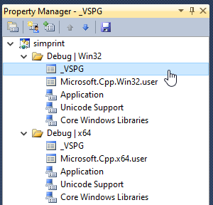

## General view

VSPG is Visual Studio Project Pre-build/Post-build Generic processing framework.
It can ease the deployment of many Prebuild/Postbuild actions for us.

By using VSPG, we extend Prebuild/Postbuild actions by writing batch(.bat) files
that are maintained outside of Visual Studio project files(.vcxproj/.csproj etc).
Actually, VSPG itself is written mostly in .bat files.

A typical usage scenario is: You want your output EXE/DLL to be copied to a remote machine, 
F5 to start remote debugging immediately, and do it robustly.

Features:
* Robust. All errors in .bat are reported and cause project-build(F7) to fail.
* Easy to deploy. 
* Be little intrusive. We can deploy VSPG features team-wide or personal-only.
* Extensibility. You can customize your own Prebuild/Postbuild commands and
  hook them into the VSPG and they get all benefits by VSPG framework.
* Co-existence of many Prebuild/Postbuild actions is feasible.

## System requirements

You need at least Visual Studio(VSIDE) 2010, and Windows 7. The MSBuild 4.0 infrastructure 
provides facility to run VSPG.


## How to deploy? 

The key is to know how to "bootstrap" VSPG. To do this, we need to 
hook VSPG's bat files into Visual Studio project (.vcxproj or .csproj). 
See "Bootstrapping Best Practice" section below for how to do this.

Please be clear: Merely Bootstrapping VSPG in your .vcxproj/.csproj
will not actually change the project-building behavior, so it does NOT affect
your team fellows on another svn/git sandbox, as if VSPG is hidden.

There must exist some actual file(s) that is recognized by VSPG, in order to
make VSGP carry out actual actions. We call them triggering files.

For example, VSIDE's project-building behavior changes after you drop a 
[`VSPU-CopyOrClean.bat`](../_VSPG/samples/VSPU-CopyOrClean.bat.md) into your own sandbox. 
So, `VSPU-CopyOrClean.bat` is your personal stuff to tune/tweak, catering 
your personal need(copy output EXE to a remote machine for live debugging etc).

On the other hand, if you want VSPG to work for all your team members, you can 
write commands in `Team-Prebuild.bat` and/or `Team-Postbuild.bat` and check them into
svn/git repo. These very two .bat filenames are scanned explicitly by VSPG 
framework code, so in user's perspective, their existence is enough to take effect.

## Bootstrapping Best Practice (for vcxproj as example) 

A versed Visual Studio user knows that setting Prebuild/Postbuild commands 
from VSIDE is very cumbersome, because you have to set them in each .vcxproj, 
each Release/Debug variant, each x86/x64 variant, so many repetitive copy/paste. 

Luckily, there is a best practice in importing VSPG into Visual Studio project 
build-flow. I call this import action "bootstrapping".

### [STEP 1] Copy the whole `_VSPG` directory to your own project.

Please keep the directory name `_VSPG` intact. Aside from that, you can place it 
anywhere you like.

Note: User should NOT modify .bat files inside `[boots]` subdir, because files there
are considered internal to VSPG.

Assume that you place it inside $(SolutionDir), i.e. side-by-side with your .sln file.

### [STEP 2] Open foo.vcxproj in a text editor, at near-end of the file, 
right before the closing </Project> tag, add content:

```
  <!-- import VSPG start -->
  <PropertyGroup>
    <VSPG_BootsDir_NoTBS>$(SolutionDir)_VSPG\boots</VSPG_BootsDir_NoTBS>
  </PropertyGroup>
  <ImportGroup Label="PropertySheets">
    <Import Project="$(VSPG_BootsDir_NoTBS)\_VSPG.props" />
  </ImportGroup>
  <!-- import VSPG end -->
```

(hint: _NoTBS means No Trailing BackSlash)

so the end of a foo.vcxproj looks like this:

```
...
  <Import Project="$(VCTargetsPath)\Microsoft.Cpp.targets" />
  <ImportGroup Label="ExtensionTargets">
  </ImportGroup>
  
  <!-- import VSPG start -->
  <PropertyGroup>
    <VSPG_BootsDir_NoTBS>$(SolutionDir)_VSPG\boots</VSPG_BootsDir_NoTBS>
  </PropertyGroup>
  <ImportGroup Label="PropertySheets">
    <Import Project="$(VSPG_BootsDir_NoTBS)\_VSPG.props" />
  </ImportGroup>
  <!-- import VSPG end -->
</Project>
```

This step defines a MSBuild variable named `VSPG_BootsDir_NoTBS` telling where 
you have placed the `_VSPG\boots` folder, so that `_VSPG.props` in that dir 
will be automatically imported into VSIDE when you open that project.

Of course, you can place `_VSPG` folder at other places, for example, in parent
dir of .vcxproj so that multiple .vcxproj shares a single copy of VSPG framework code.
Just change `VSPG_BootsDir_NoTBS`'s directory-prefix accordingly. 
If you want to use relative dir-prefix, that's OK and 
it is relative to $(ProjectDir), that is where foo.vcxproj resides.

To verify: Open .vcxproj and goto Property Manager, and you should see "_VSPG.props"
is listed as a property-sheet, side-by-side with "Microsoft.Cpp.Win32.user",
"Core Windows Libraries" etc.




### [STEP 3] Repeat STEP 2 for each .vcxproj of your interest.

OK now, with above minor manual tweak of .vcxproj, we have applied VSPG project-wide.
By saying "project-wide", I mean, x86/x64, Debug/Release build variants all receive VSPG's benefits.

### First actual example

See here: [simprint](../demo-vsprojs/simprint/README.md)

## Customize VSPG further

VSPG's actual behavior is customized by adding more triggering files.

We have a bunch of triggering file samples ready for customization. [Check here for a list](samples/README.md).
