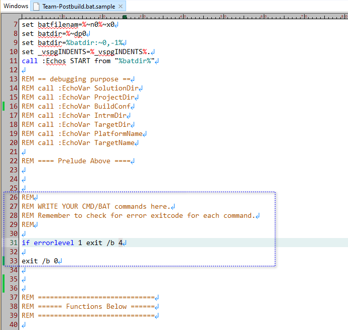

`Team-Postbuild.bat.sample` is the shared template file for 
* Team-Prebuild.bat
* Team-Postbuild.bat
* Personal-Prebuild.bat
* Personal-Postbuild.bat

In Visual Studio project Prebuild stage(before any .cpp -> .obj compiling starts), `Team-Prebuild.bat` is called followed by `Personal-Prebuild.bat`.

In Visual Studio project Postbuild stage(after EXE is generated), `Team-Postbuild.bat` is called followed by `Personal-Postbuild.bat`.

These .bat files share the same file structure. As VSPG user, after making a copy of this sampel, you should keep "Prelude" part of it, and write your own batch commands after the Prelude. 

For concrete usage case, see example [embed-svnrev](../../demo-vsprojs/embed-svnrev/).
