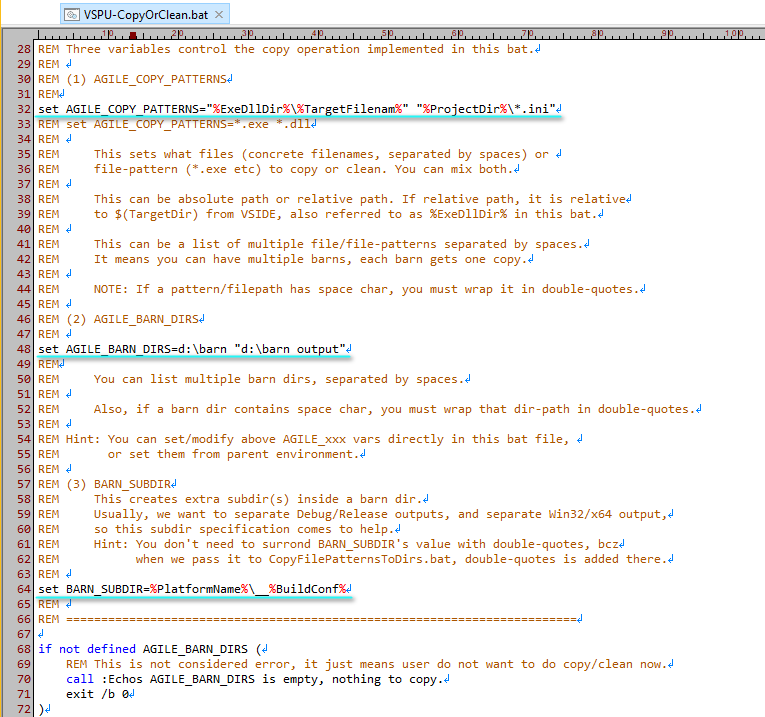

Demo program: [simprint](../../demo-vsprojs/simprint)

## Triggering point

`VSPU-CopyOrClean.bat` is called at two triggering points.

- In **Postbuild** stage of the project-build(typically, after the EXE file is generated), where we(VSPG user) expect it to do some copy operation, typically, copy the generated EXE file to some extra target location.
- In **Clean** stage (when you tell VSIDE to clean your project), where we expect it to clean files in extra target location.

Some common scenarios that we may want such extra copy operation:

- If we have more than one vcxproj, or even more than one solution(.sln), and we want to collect all their output binaries(exe, dll etc) to a single final directory, or multiple final directories(just call them barn directories, or barns), maybe for later software packaging or testing, or any purpose you could imagine.
- Copy output binaries(exe, dll etc) to a remote PC to do remote debugging immediately.

## Modification to sample file

There are three batch vars you need to set in this .bat file.

| Varname | Purpose |
| ------- | ------- |
| AGILE_COPY_PATTERNS | Tell what source files to copy. |
| AGILE_BARN_DIRS | Your barn directories. |
| BARN_SUBDIR | Extra subdir part inside your barn directory. |

### AGILE_COPY_PATTERNS

This can have multiple tokens, separated by spaces. 

Each token can be a filepath, or, a path with wildcards.

For example, for an EXE project, you want to copy the target EXE and configuration file(*.ini) to barn, you can write:

```
set AGILE_COPY_PATTERNS="%ExeDllDir%\%TargetFilenam%" "%ProjectDir%\*.ini"
```

Note: 
- `%ExeDllDir%` is the synonym of `%TargetDir%` (`_VSPG.props` proves it), something like `D:\gitw\VSPG\demo-vsprojs\simprint\bin-v100\Win32\Debug`. But why do I come up with an alias `%ExeDllDir%`? Because the "target" in `TargetDir` is in the perspective of Visual C++ compiler, i.e. the EXE file is the compiler's output; but in VSPG user's perspective, the EXE file is the copy source, not the target. The word "target" becomes misleading here, so, I think ExeDllDir is a better choice. 
- `%TargetFilenam%` is not a typo, it is the same as `%TargetFilename%`, for example, "simprint.exe". I drop the tail 'e' to imply that, this value is a pure filename, NO directory prefix. You know, in MSBuild's naming, some FooFilename is a pure filename, and some other BarFilename has directory prefix, quite a pit for misuse.
- Each token should be wrapped in double-quotes, so that it still works smoothly when any part of the path contains space char.

### AGILE_BARN_DIRS

As the name implies, it tells your barns, .i.e. target directories of the extra copy.

For example, to assign two barns, write:

```
set AGILE_BARN_DIRS=d:\barn "d:\barn output"
```

Always be aware, if some directory contains space-char, you must wrap it in double-quotes.

### BARN_SUBDIR

This is extra sub-directory inside/beneath each barn.

I bet you will quickly get the idea if you work with multiple **BuildConf** (Debug or Release) or multiple target platform(Win32 or x64) of a vcxproj.

For the same EXE output filename, simprint.exe for example, there will typically be four variants of it. And, we might probably want them to co-exist side-by-side at the same time. So, the variants have to be placed inside differnt sub-directories.

For example:

```
set BARN_SUBDIR=%PlatformName%\__%BuildConf%
```

We will simultaneously see these files:

```
D:\barn\Win32\__Debug\simprint.exe
D:\barn\Win32\__Release\simprint.exe
D:\barn\x64\__Debug\simprint.exe
D:\barn\x64\__Release\simprint.exe
```

Of course, If don't like the subdir structure shown above, feel free to adjust `BARN_SUBDIR`'s value in your `VSPU-CopyOrClean.bat`, or, in your Env-var.


## Some more words

The sample `VSPU-CopyOrClean.bat` provided by VSPG framework, uses `CopyFilePatternsToDirs.bat`(also provided by VSPG) to do actual copy/clean operation. I think this stock sample has fulfilled quite a broad range of requirements. But if you really need non-typical copying operation, you have to implement `VSPU-CopyOrClean.bat` entirely by your own.

`VSPU-CopyOrClean.bat.sample` is a bit lengthy, bcz it has quite some comments to guide you through. Remember, you just need to modify three batch vars there, like the image shown below.



