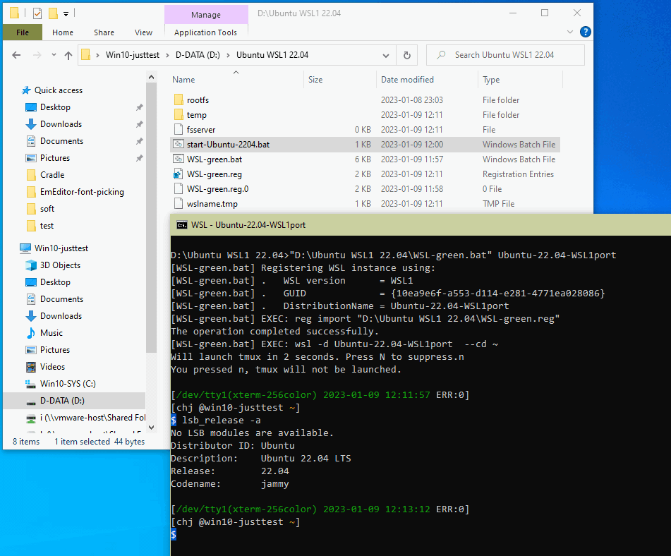

## A bat file to live-register your WSL instance into Windows 10.

`WSL-green.bat` here registers the WSL file-system at current directory into your 
Windows 10 system, so that you can use `wsl -d FoobarDistributionName` to run it. 

This makes your WSL instance become totally **portable**, that is, no longer 
need to install it from Microsoft Store every time you move/copy your WSL folder 
to a new windows 10 machine.

## How to use

### [STEP 1] 

You need to first have an already installed WSL1 or WSL2 file-system in an NTFS folder.

Assume that folder is `D:\WSL-Ubuntu-2204`, and 

if it contains WSL1, you have these sub-folders:

	D:\WSL-Ubuntu-2204\rootfs
	D:\WSL-Ubuntu-2204\rootfs\root
	D:\WSL-Ubuntu-2204\rootfs\etc\init.d

If it contains WSL2, you have a single file:

	D:\WSL-Ubuntu-2204\ext4.vhd

### [STEP 2]

Copy files here to your WSL folder, that is, you should finally have:

	D:\WSL-Ubuntu-2204\WSL-green.reg.0
	D:\WSL-Ubuntu-2204\WSL-green.bat

### [STEP 3]

Create a simple wrapper bat, any name you like, for example, `start-Ubuntu-2204.bat`, 
with only one line:

	"%~dp0WSL-green.bat" Ubuntu-22.04-portable bob

Note:

* `Ubuntu-22.04-portable` is the so-called "distribution name" recognized by `wsl -d`.
  You select this name by yourself.
* The "distribution name" **must not contains space-char**, at least for Win10.21H2.
* If the distribution name conflicts with an existing one on current Win10 machine. 
  That name will point to this "new" distribution, and the "old" one is masked off.
  So, to ensure no conflict, please use `wsl -l` in advance to know what distribution names 
  have already existed on your Win10 host machine.
* The `bob` assigns the default login user, you should replace it to an existing user name 
  on your target WSL instance. This user name will be passed to `wsl -d` as `-u bob`. 
  You can omit this parameter, then the wsl.exe will pick the user told by the registry item 
  `DefaultUid`(usually 0x3e8, =1000, the first Linux user created).

Now, run your `start-Ubuntu-2204.bat` and the WSL instance launches.



## Comments

Inside `WSL-green.bat`, it will use `WSL-green.reg.0` as template, generate real 
`WSL-green.reg`, and then import that `WSL-green.reg` to your Windows so to live-register 
your `D:\WSL-Ubuntu-2204` as a new WSL instance.

Upon registering done, `WSL-green.bat` runs `wsl -d Ubuntu-22.04-portable` immediately to launch
that WSL instance.

There is no harm registering the same WSL instance repeatedly, so `WSL-green.bat` does "register"
and "run" in one shot.

Administrator privilege is not required to register and run the .bat provided here.

## What if something goes wrong

I suggest reviewing the generated `WSL-green.reg` to see whether there is some problem in it.

A sample `WSL-green.reg` content looks like this:

```ini
Windows Registry Editor Version 5.00

[HKEY_CURRENT_USER\SOFTWARE\Microsoft\Windows\CurrentVersion\Lxss\{1ce81a28-7b3f-6cee-5290-0cf0a2177bd8}]
"State"=dword:00000001
"Version"=dword:00000002
"DefaultUid"=dword:000003e8
"KernelCommandLine"="BOOT_IMAGE=/kernel init=/init"
"DefaultEnvironment"=hex(7):48,00,4f,00,53,00,54,00,54,00,59,00,50,00,45,00,3d,\
  00,78,00,38,00,36,00,5f,00,36,00,34,00,00,00,4c,00,41,00,4e,00,47,00,3d,00,\
  65,00,6e,00,5f,00,55,00,53,00,2e,00,55,00,54,00,46,00,2d,00,38,00,00,00,50,\
  00,41,00,54,00,48,00,3d,00,2f,00,75,00,73,00,72,00,2f,00,6c,00,6f,00,63,00,\
  61,00,6c,00,2f,00,73,00,62,00,69,00,6e,00,3a,00,2f,00,75,00,73,00,72,00,2f,\
  00,6c,00,6f,00,63,00,61,00,6c,00,2f,00,62,00,69,00,6e,00,3a,00,2f,00,75,00,\
  73,00,72,00,2f,00,73,00,62,00,69,00,6e,00,3a,00,2f,00,75,00,73,00,72,00,2f,\
  00,62,00,69,00,6e,00,3a,00,2f,00,73,00,62,00,69,00,6e,00,3a,00,2f,00,62,00,\
  69,00,6e,00,3a,00,2f,00,75,00,73,00,72,00,2f,00,67,00,61,00,6d,00,65,00,73,\
  00,3a,00,2f,00,75,00,73,00,72,00,2f,00,6c,00,6f,00,63,00,61,00,6c,00,2f,00,\
  67,00,61,00,6d,00,65,00,73,00,00,00,54,00,45,00,52,00,4d,00,3d,00,78,00,74,\
  00,65,00,72,00,6d,00,2d,00,32,00,35,00,36,00,63,00,6f,00,6c,00,6f,00,72,00,\
  00,00,00,00

"Flags"=dword:00000007
; -- Flags: 0x07 means WSL1, 0x0f means WSL2
"BasePath"="D:\\WSL-Ubuntu-22.04\to-be-modified-by-bat"
"DistributionName"="DistributionName-to-be-modified-by-bat"

; Override Flags, BasePath and DistributionName below:

"Flags"=dword:00000007 
"BasePath"="D:\\WSL-Ubuntu-22.04" 
"DistributionName"="Ubuntu-22.04-chja20" 
```

If something can go wrong, it can be `DefaultUid` or `Flags`, tune their values according to 
your actual case.

Of course, your can open Windows registry editor, check whether these values are imported correctly. 

BTW: You may see a typical error message saying:

> `The requested operation cannot be performed on a file with a user-mapped section open`

This can be caused by two Lxss GUIDs (in registry) pointing to the same WSL1 BasePath. 
The first one can be launched correctly, but when you want to launch the second at 
the same time, that error message pops out. The solution is simple, just manually delete one of 
those GUID registry node. Of course, I suggest deleting the one not generated by `WSL-green.bat`.

